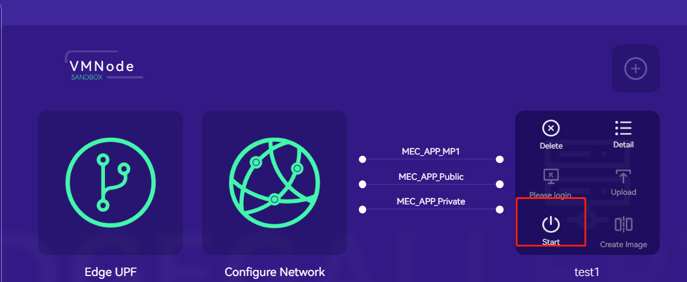

### Instantiate operation instructions after deployment（V1.5.0)

##### 1.Health check after installation

Deployment prompt will appear after successful deployment of edgegallery using ansible

kubectl get pod --all-namespaces //Check the running status of the pod. Under normal conditions, the status of the pod is running

If the status of the pod is not running, further positioning is required

The last step is to manually instantiate the test

##### 2.Manual instantiation test

Edgegallery web page login requires Chrome browser，which is currently set as a unified portal，https://master_IP:30095 （or https://PORTAL_IP:30095）

Default administrator user：admin Passwd：Admin@321

###### 2.1 Create sandbox environment

developer-->System-->Host Management

add host

The config configuration file uploaded by k8s is: root/.Kube/Config

Openstack sandbox environment is the relevant configuration file information of openstack. Edit the following files into config files and upload them:

export OS_USERNAME=admin

export OS_PASSWORD=******

export OS_PROJECT_NAME=admin

export OS_AUTH_URL=http://192.168.*.*/identity

export OS_IDENTITY_API_VERSION=3

export OS_PROJECT_DOMAIN_NAME=default

export OS_USER_DOMAIN_NAME=default

###### 2.2 Upload image

developer-->System-->System Image Management

##### 3.3 App incubation

Enter from the menu bar or home page:

Create a new application, VM or container:

Select sandbox (you can select it in the capability center when you need to deploy relevant capabilities):

Select the corresponding sandbox:

###### 3.3.1 Container application

Upload yaml and start the test：

###### 3.3.2 VM application

Configure virtual machine network and create virtual machine:

Create VM configuration:

  
      

##### 3.4 Make image

step 3

##### 3.5 Create edge node

Create MECPM

Create edge node

##### 3.6 Test certification

elect the corresponding test scenario to test:

Select release after the test is completed

##### 3.7 Mecm application package deployment

Apply to the edge through mecm deployment

App store registration:

New registration:

MECM->APP management->Package management

Sychronize From App Store

Select the synchronized package for distributed deployment:

