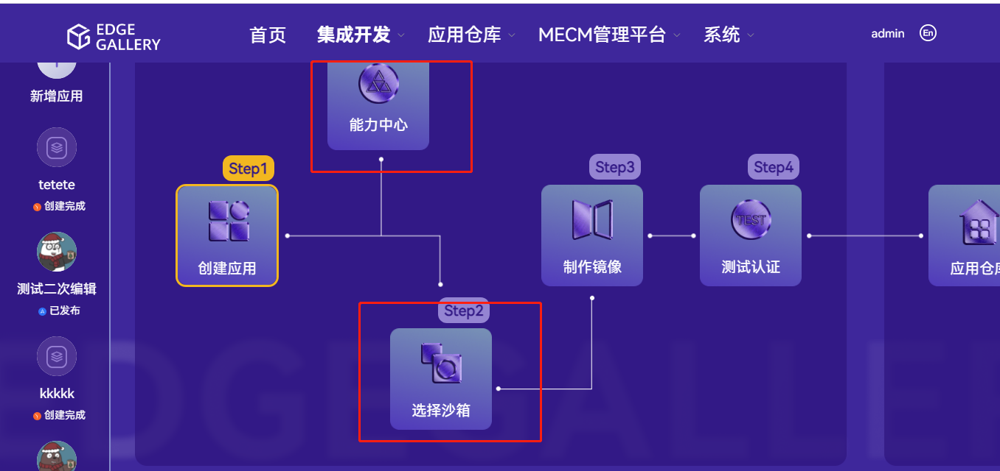

 
 

### 部署完成后实例化操作指导（v1.5.0版本）

##### 1.安装完成后的检查

使用ansible部署Edgegallery成功后会有部署提示，如果没有部署则表示部署过程中某个模块部署失败因而部署脚本退出

kubectl get pod --all-namespaces // 检查pod的运行状态，正常情况下pod的状态时running，

如果pod 的状态不是running 则需要进一步定位，例如：

kubectkl delete pod podname –n namespaces // 重启pod

kubectl describe pod podname –n namespaces // 查看pod

最后一步则需要手动实例化测试

##### 2.手动实例化测试

EdgeGallery web页面登陆需要用Chrome浏览器，目前设置的统一入口，https://master_IP:30095 （或者https://PORTAL_IP:30095）

###### 2.1 创建沙箱环境

集成开发-->系统管理-->沙箱管理

创建沙箱

K8S上传的config配置文件为：root/.kube/下的config文件

openstack沙箱环境为openstack的相关配置文件信息，将下面文件编辑成config文件上传：

export OS_USERNAME=admin

export OS_PASSWORD=******

export OS_PROJECT_NAME=admin

export OS_AUTH_URL=http://192.168.*.*/identity

export OS_IDENTITY_API_VERSION=3

export OS_PROJECT_DOMAIN_NAME=default

export OS_USER_DOMAIN_NAME=default

##### 2.2 上传镜像

集成开发-->系统管理-->系统镜像管理

容器镜像和虚拟机镜像：

##### 3.3 应用孵化

从菜单栏或者首页进入：

新建应用,虚机或者容器:

选择沙箱（需要部署相关能力时可在能力中心选择）：

选择对应的沙箱：

###### 3.3.1 容器应用

容器类应用上传脚本yaml文件：

上传yaml文件

选择容器启动沙箱测试

查看详情：

###### 3.3.2 虚机应用

配置虚机网络创建虚机:

创建虚机配置：

配置完成后启动测试：

VNC登录，上传文件，生成镜像等功能体验。

##### 3.4 制作镜像

选择打包预览，可以编辑预览生成的包：

##### 3.5 边缘节点信息创建

MECM管理平台-系统-MEPM系统注册
新增mepm：

MECM管理平台-边缘节点
新增边缘节点（上传对应边缘节点的config文件）：

##### 3.6 测试认证

选择对应的测试场景进行测试：

测试完成成后选择发布：

在应用仓库查看已发布的应用。

##### 3.7 MECM应用包部署

通过MECM部署应用到边缘

应用仓库注册

MECM管理平台-系统-应用仓库注册

新增注册：

MECM管理平台-系统-应用包管理  

同步APPSTORE仓库应用：

选择同步完成的包进行分布部署：

