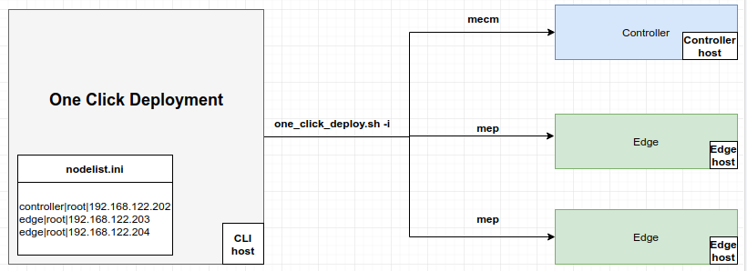

** THIS IS ABSOLUTED, AND WILL BE REMOVED IN NEXT RELEASE. [Refer](../README.md) for latest **

# EdgeGallery Quick Start
## Introduction
**EdgeGallery:** provides an IT service environment and cloud-computing capabilities at the edge of an access network
which contains one or more type of access technology, and in close proximity to its users.
Inspired from edge computing architecture defined by the ETSI Multi-access Edge Computing standards.

**MECM:** has an overview of the complete MEC system & handles the management of the MEC specific functionality of a
particular MEC platform, MEC host and the MEC applications running on it.

**MEP:**  MEC platform to run mobile edge applications on a specific mobile edge host virtualisation
infrastructure and to enable them to provide and consume mobile edge services, and that can provide itself a number of
mobile edge services.

## Topology

## Platform Requirements
 at this time the following options are recommended:

**OneClickDeployment CLI host:**

Do not need a dedicated server, can also use Controller host as as CLI host.
 - Ubuntu 16.04.6 LTS [x86_64, aarch64]
 - CentOS-7  [x86_64, aarch64]

**Controller/MECM host**

Multiple hosts for Controller are also accepted, a k8s cluster will be be formed with the provided controller hosts.
 - Ubuntu 18.04.3 LTS [aarch64]
 - CentOS Linux release 7.8.2003 (Core)  [x86_64]

**Edge/MEP host**
 - Ubuntu 18.04.3 LTS [aarch64]
 - CentOS Linux release 7.8.2003 (Core)  [x86_64]

## Preconditions
**prefer login as root user**
### Exchange SSH keys with the hosts
Exchanging SSH keys allows password-less SSH from host running One Click Deployment  CLI to the hosts being set up.
```
1. Host running One Click Deployment CLI must have generated SSH key.
Note: run the below command as a root user
command: ssh-keygen

2. Copy the generated SSH key of cli host to the edge & controller nodes
command: ssh-copy-id root@node_ip
```
```
3. Not aware of root password of nodes?
then append the content of cli host's /root/.ssh/id_rsa.pub
to the Edge & Controller node's /root/.ssh/authorized_keys
```
### Install sshpass on CLI host
**ubuntu:**
`apt-get install sshpass`

**centos:**
```
yum search epel-release
yum info epel-release
yum install epel-release
yum install sshpass
```
### Clone EdgeGallery deployment scripts on CLI host
`git clone https://github.com/EdgeGallery/platform-mgmt.git`
### Update nodelist.ini
Update `platform-mgmt/nodelist.ini` with Edge & Controller Node details

**Syntax:**
```
<edge>|<username>|<IP>
<controller>|<username>|<IP>
```
**Limitations:**
```
1. Multiple Controller entries not to be done
2. If Controller & Edge nodes are same, two entries should be made, one for Controller & another for Edge but with same IP
```
**Example:** MEP & MECM to be installed in same machine
```
controller|root|192.168.122.202
edge|root|192.168.122.202
```
**Example:** MEP & MECM to be installed in different machines
```
controller|root|192.168.122.202
edge|root|192.168.122.203
```
**Example:** when multiple edge nodes & single controller is required
```
controller|root|192.168.122.202
edge|root|192.168.122.203
edge|root|192.168.122.204
edge|root|192.168.122.205
```
**Example:** when multiple controller hosts are required
```
controller|root|192.168.122.202
controller|root|192.168.122.203
edge|root|192.168.122.204
```
## EdgeGallery Modules & their respective Nodes
**MEP:**  `Edge Node`

**MECM:** `Controller Node`

**app-store:** `Controller Node`

**user-mgmt** `Controller Node`

**developer:** `Controller Node`

**service-center:** `Controller Node`

**tool-mgmt:** `Controller Node`

## Deploy EdgeGallery using CLI
Follow [deploy EdgeGalery using cli](doc/deploy_edgegallery_with_cli.md) document for deploying edgegallery using cli.

## Deploy EdgeGallery using bash script
Follow [deploy EdgeGallery using scripts ](doc/deploy_edgegallery_with_scripts.md) document for deploying edgegallery using bash script

## EdgeGallery Ingress deployment
Follow [EdgeGallery Ingress Deployment](doc/edgegallery_ingress_deployment.md)

## Verification of EdgeGallery Deployment
Deployment can be verified as follows
1. **Console output** prints success/failure of the Components installation
2. Logs will be created in **platform-mgmt/logs**
3. Log into Edge & Controller Nodes & check output of the command
`kubectl get all --all-namespaces`
`helm ls`
